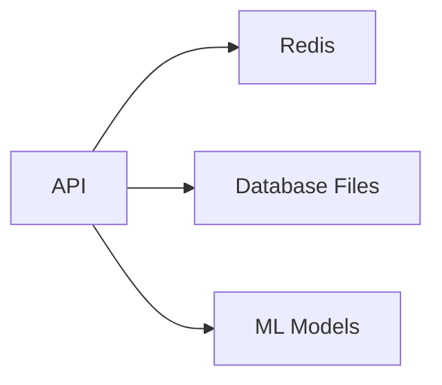

# 🐳 Docker Quick Start Guide

## Prerequisites

- Docker Desktop installed ([Download here](https://www.docker.com/products/docker-desktop/))
- Docker Compose (included with Docker Desktop)

---

## 🚀 Quick Start (3 Commands)

```bash
# 1. Clone/navigate to project
cd Special_project

# 2. Start everything
docker-compose up

# 3. Access the API
# API: http://localhost:5001
# Docs: http://localhost:5001/api/docs
# Health: http://localhost:5001/api/health
```

That's it! The API is now running with Redis caching.

---

## 🛠️ Common Commands

### Start Services

```bash
# Start in foreground (see logs)
docker-compose up

# Start in background (detached)
docker-compose up -d

# Start only specific service
docker-compose up redis
```

### Stop Services

```bash
# Stop all services
docker-compose down

# Stop and remove volumes (⚠️ deletes data)
docker-compose down -v
```

### View Logs

```bash
# All services
docker-compose logs

# Specific service
docker-compose logs api
docker-compose logs redis

# Follow logs (live)
docker-compose logs -f api
```

### Rebuild After Changes

```bash
# Rebuild and start
docker-compose up --build

# Force rebuild (no cache)
docker-compose build --no-cache
docker-compose up
```

### Check Status

```bash
# List running containers
docker-compose ps

# Check health
curl http://localhost:5001/api/health | jq
```

---

## 🏭 Production Deployment

### Build Production Image

```bash
# Build optimized production image
docker build -t moodtracker-api:latest .

# Or use docker-compose
docker-compose -f docker-compose.yml -f docker-compose.prod.yml build
```

### Run Production

```bash
# Start with production settings
docker-compose -f docker-compose.yml -f docker-compose.prod.yml up -d

# Check status
docker-compose -f docker-compose.yml -f docker-compose.prod.yml ps
```

### Environment Variables (Production)

Create `.env` file:

```bash
# Copy example
cp .env.example .env

# IMPORTANT: Update these for production!
SECRET_KEY=<generate-random-64-char-string>
JWT_SECRET_KEY=<generate-random-64-char-string>
REDIS_PASSWORD=<strong-password>

FLASK_ENV=production
DEBUG=False
LOG_LEVEL=WARNING

# Your OAuth credentials
GOOGLE_CLIENT_ID=your-real-google-id
GITHUB_CLIENT_ID=your-real-github-id
GITHUB_CLIENT_SECRET=your-real-github-secret
```

---

## 🔍 Troubleshooting

### Port Already in Use

```bash
# Check what's using port 5001
lsof -i :5001  # Mac/Linux
netstat -ano | findstr :5001  # Windows

# Use different port
docker-compose up
# Edit docker-compose.yml: "5002:5001"
```

### Container Won't Start

```bash
# Check logs
docker-compose logs api

# Rebuild from scratch
docker-compose down -v
docker-compose build --no-cache
docker-compose up
```

### Redis Connection Failed

```bash
# Make sure Redis is running
docker-compose ps

# Check Redis logs
docker-compose logs redis

# Test Redis connection
docker-compose exec redis redis-cli ping
# Should return: PONG
```

### Permission Denied Errors

```bash
# On Linux, fix permissions
sudo chown -R $USER:$USER .

# Or run with sudo (not recommended)
sudo docker-compose up
```

### Models Not Loading

Models are mounted from host, so make sure they exist:

```bash
# Check model directories exist
ls -la Fine_tuned_RoBERTa/
ls -la mentalbert_sentiment_model/

# If missing, ML models won't load (API will still run)
```

---

## 📦 Docker Compose Services

### Services Included

| Service | Port | Purpose |
|---------|------|---------|
| **redis** | 6379 | Caching & rate limiting |
| **api** | 5001 | Flask API backend |
| (frontend) | 5173 | React frontend (optional) |

### Service Dependencies



API depends on:
- Redis (for caching, optional)
- Database files (volume mounted)
- ML models (volume mounted)

---

## 💾 Data Persistence

### Volumes

Docker creates these volumes:

```bash
# List volumes
docker volume ls | grep moodtracker

# Inspect volume
docker volume inspect special_project_api_data
```

**Volumes Created:**
- `redis_data` - Redis persistence
- `api_data` - Database files
- `api_logs` - Application logs

### Backup Data

```bash
# Backup database
docker cp moodtracker-api:/app/data ./backup/

# Restore database
docker cp ./backup/data moodtracker-api:/app/
```

---

## 🧪 Development Workflow

### Hot Reload (Development)

Code changes are automatically reflected (no restart needed):

```bash
# Start in development mode
docker-compose up

# Edit files in ./api/
# Save changes
# API automatically reloads ✨
```

### Run Tests Inside Container

```bash
# Enter container
docker-compose exec api bash

# Run tests
python -m pytest api/tests/

# Exit
exit
```

### Install New Dependencies

```bash
# 1. Add to requirements.txt
echo "new-package>=1.0.0" >> requirements.txt

# 2. Rebuild
docker-compose up --build
```

---

## 🌐 Accessing Services

### API Endpoints

```bash
# Health check
curl http://localhost:5001/api/health

# Swagger docs
open http://localhost:5001/api/docs  # Mac
start http://localhost:5001/api/docs  # Windows
xdg-open http://localhost:5001/api/docs  # Linux

# Test prediction
curl -X POST http://localhost:5001/api/predict/roberta \
  -H "Content-Type: application/json" \
  -d '{"text": "I am feeling great today!"}'
```

### Redis

```bash
# Access Redis CLI
docker-compose exec redis redis-cli

# In Redis CLI:
> PING
PONG

> KEYS *
(shows all keys)

> GET moodtracker_some_key

> EXIT
```

---

## 🔒 Security Notes

### Development

- Uses default secrets (insecure)
- Debug mode enabled
- Verbose logging

**Never use development config in production!**

### Production

- Must set strong secrets
- Debug mode disabled
- Redis password-protected
- Security headers enabled
- Minimal logging

---

## 📊 Monitoring

### Health Check

```bash
# Simple check
curl http://localhost:5001/api/health

# Pretty JSON
curl http://localhost:5001/api/health | jq

# Watch continuously
watch -n 5 'curl -s http://localhost:5001/api/health | jq .status'
```

### Logs

```bash
# Real-time logs
docker-compose logs -f

# Last 100 lines
docker-compose logs --tail=100

# Save logs to file
docker-compose logs > logs.txt
```

### Resource Usage

```bash
# Container stats
docker stats

# Specific container
docker stats moodtracker-api
```

---

## 🆘 Emergency Commands

### Something Broke - Full Reset

```bash
# Nuclear option: delete everything and start fresh
docker-compose down -v --remove-orphans
docker system prune -a --volumes -f
docker-compose up --build
```

⚠️ **WARNING**: This deletes all data!

### API Not Responding

```bash
# Restart just the API
docker-compose restart api

# Or restart everything
docker-compose restart
```

### Out of Disk Space

```bash
# Clean up Docker
docker system prune -a

# Remove old images
docker image prune -a

# Remove unused volumes
docker volume prune
```

---

## 📚 Additional Resources

- [Docker Documentation](https://docs.docker.com/)
- [Docker Compose Reference](https://docs.docker.com/compose/compose-file/)
- [Flask in Docker](https://docs.docker.com/language/python/)
- [Docker Security Best Practices](https://docs.docker.com/develop/security-best-practices/)

---

## 🎓 Next Steps

Once comfortable with Docker:

1. **Customize docker-compose.yml** for your needs
2. **Add frontend** service (uncomment in docker-compose.yml)
3. **Set up CI/CD** pipeline
4. **Deploy to cloud** (AWS, Google Cloud, Azure)
5. **Add monitoring** (Prometheus, Grafana)

---

**Happy Dockerizing! 🐳**
